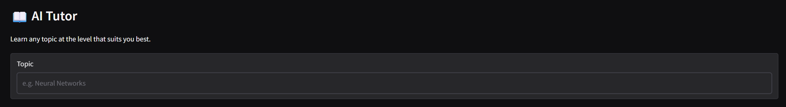
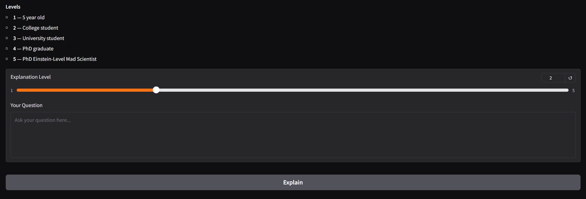
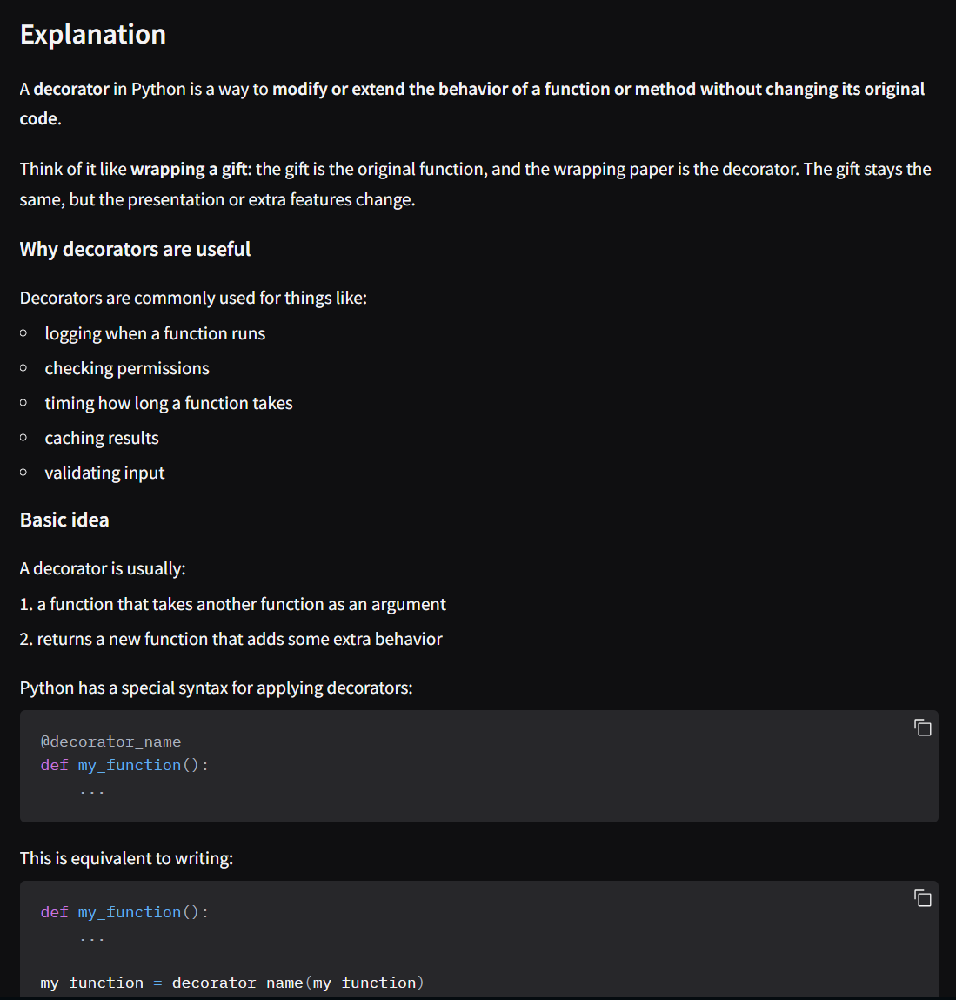

# 🧠 AI Tutor — Multi-Level Learning with LLMs

## 🚀 Overview

AI Tutor is an **interactive AI-powered learning application** that adapts explanations dynamically based on the learner’s level — from a **5-year-old beginner to an Einstein-level PhD thinker**.

The system is built using a **modular LLM pipeline**, combining:

* Level-aware prompt engineering
* Streaming response generation
* Structured markdown outputs
* A real-time Gradio interface

This project demonstrates how to transform a simple LLM prototype into a **production-style, modular AI system**.

---

## 🎯 Problem Statement

Learning complex topics is often:

* Too generic
* Not adapted to the learner’s level
* Either too simplified or overly complex

This project explores how AI can:

1. Dynamically adjust explanation depth
2. Provide structured and intuitive learning outputs
3. Deliver real-time, interactive tutoring experiences

---

## 🎥 Demo

### Input Interface

Upload your topic, ask a question, and select the explanation level from 1 to 5.



### Explanation Level Slider

The slider allows the same topic to be explained with very different levels of depth.



### Streaming Tutor Response

Responses are streamed live into the UI for a more interactive tutoring experience.


### Structured Output

The tutor responds in markdown with:

* Explanation
* Example
* Follow-up Question



---

## 🧠 Solution Architecture

The system is designed as a **layered AI pipeline**, ensuring separation of concerns and extensibility.

### 🔄 Flow

```text
User Input (UI)
   ↓
Validation Layer
   ↓
Tutor Service (Orchestration)
   ↓
Prompt Builder (Level-aware logic)
   ↓
OpenAI Gateway (Streaming LLM call)
   ↓
Token Stream → UI (Live Rendering)
```

---

## 🏗️ Project Structure

```text
AI-Tutor-with-Gradio-for-Multi-Level-Learning/
├── app/
│   ├── main.py                 # App assembly
│   ├── config/
│   │   └── settings.py         # Environment config
│   ├── clients/
│   │   └── openai_client.py    # LLM gateway
│   ├── domain/
│   │   └── models.py           # Request/response schemas
│   ├── prompts/
│   │   └── tutor_prompts.py    # Prompt engineering logic
│   ├── services/
│   │   └── tutor_service.py    # Core orchestration layer
│   ├── ui/
│   │   └── gradio_app.py       # UI + streaming handler
│   └── utils/
│       └── logger.py           # Logging utility
│
├── assets/                     # Screenshots / demo GIFs
├── run.py                      # Entry point
├── .env.example                # Environment variables template
├── requirements.txt
└── README.md
```

---

## ⚙️ Tech Stack

* **Python**
* **OpenAI Models**
* **Gradio**
* **Pydantic**
* **pydantic-settings**
* **httpx**

---

## 🧪 Features

* 🎚️ **Dynamic Learning Levels (1–5 Slider)**

  * 1 → 5-year-old explanation
  * 2 → College student
  * 3 → University student
  * 4 → PhD graduate
  * 5 → Einstein-level mad scientist

* ⚡ **Streaming Responses**

  * Token-by-token generation for real-time UX

* 🧠 **Prompt Engineering Layer**

  * Level-specific instruction injection

* 📝 **Structured Output**

  * Markdown-formatted responses

* 🧩 **Modular Architecture**

  * UI, prompts, service layer, and client separated cleanly

* 🔒 **Input Validation**

---

## ▶️ How to Run

### 1. Clone the repository

```bash
git clone https://github.com/vinishvivek/AI-Tutor-with-Gradio-for-Multi-Level-Learning.git
cd AI-Tutor-with-Gradio-for-Multi-Level-Learning
```

### 2. Create environment

```bash
conda create -n ai_tutor python=3.11
conda activate ai_tutor
```

or

```bash
python -m venv venv
source venv/bin/activate   # Mac/Linux
venv\Scripts\activate      # Windows
```

### 3. Install dependencies

```bash
pip install -r requirements.txt
```

### 4. Configure environment variables

Create a `.env` file:

```text
OPENAI_API_KEY=your_api_key_here
LLM_MODEL=gpt-5.4-mini
```

### 5. Run the app

```bash
python run.py
```

Then open:

```text
http://127.0.0.1:7860
```

---

## ⚠️ Limitations

* Output quality depends on prompt effectiveness
* Streaming speed depends on the selected model and network conditions
* No conversation memory yet
* Responses are educational, not authoritative

---

## 🔧 Engineering Highlights

This project intentionally focuses on **AI system design**, not just raw model usage:

* ✅ Streaming-first UX
* ✅ Prompt engineering abstraction
* ✅ Typed request validation
* ✅ Service-layer orchestration
* ✅ UI decoupled from model logic
* ✅ Config-driven setup
* ✅ Clean modular structure for future expansion

---

## 🚀 Future Improvements

* Multi-turn memory
* Quiz / challenge mode
* RAG over custom documents
* User progress tracking
* Cost/token monitoring dashboard
* FastAPI backend
* Docker deployment
* Hugging Face Spaces deployment

---

## 📌 Key Takeaway

This project is not just about tutoring.

It demonstrates how to:

> Build a **modular, production-oriented AI application**
> with streaming outputs, adaptable prompting, and scalable architecture.

---

## 👤 Author

**Vinish Vivek**

AI Engineer | LLM Systems | RAG Pipelines | Applied AI Development

---

## ⭐ If you found this useful

Consider starring the repo — or better, fork it and build your own version 🚀

---
